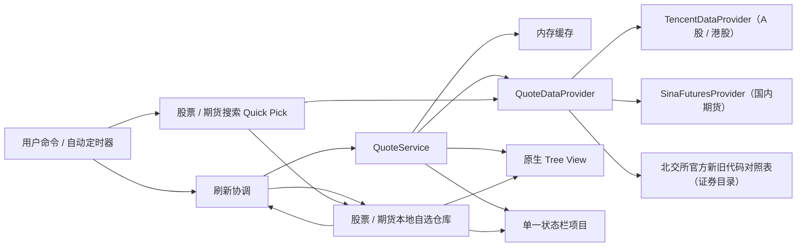

# FishStock 架构

## 设计目标

架构只保留当前阶段需要的边界：领域模型、行情数据源、本地存储、刷新调度、原生 Tree View 和单状态栏。模块通过小接口协作，避免为了未来功能引入框架或过度抽象。

## 视图层级与功能边界

```text
FishStock（Activity Bar 容器）
├─ Stock（fishStock.stock）
│  └─ 分组 → 个股或指数
├─ Futures（fishStock.futures）
│  └─ 分组 → 主连或月份合约
└─ Fund（未来可选，当前不实现）
```

`Stock` 和 `Futures` 是 FishStock 容器中的两个同级 View，不是自选树的根节点。股票和市场指数共享 Stock 分组；期货因交易时段、代码和行情字段不同，使用独立命令、存储和数据提供器。两类行情只在单一状态栏轮播和通用价格模型处汇合。未来若增加基金，也应贡献同级 View，不把不同品类混入一棵树。

## 模块

| 模块 | 目录 | 责任 |
| --- | --- | --- |
| 领域模型 | `src/domain` | 股票、分组、行情结构；代码规范化；顺序调整；交易日历与休市判断；视图展示方式；行情页 URL 模板 |
| 行情数据 | `src/data` | 提供器接口、腾讯股票行情、新浪期货行情、北交所证券目录、节假日休市数据、缓存及请求合并 |
| 本地存储 | `src/storage` | 股票与期货的独立版本化自选结构、视图展示方式存储、校验和读写 |
| 刷新调度 | `src/services` | 自动刷新间隔与同一任务合并 |
| 行情展示 | `src/ui/quoteTooltip.ts` | Tree View 与状态栏共享的价格格式和原生行情浮窗 |
| Tree View | `src/ui/watchlistTreeProvider.ts` | 两层原生树、状态文案、主题颜色、排序与筛选 |
| 状态栏 | `src/ui/statusBarController.ts` | 按“股票名称 + 现价 + 涨跌幅”轮播，悬停复用完整行情浮窗 |
| 命令 | `src/commands` | 参数化命令集 `registerWatchlistCommands`，按股票/期货的命令 ID 与文案装配添加、删除、分组、排序、清空、恢复默认、视图方式与行情页跳转 |
| 装配入口 | `src/extension.ts` | 激活、配置响应、模块生命周期 |

## 数据流



刷新读取本机自选列表，将规范化代码交给 `QuoteService`。服务按代码排序生成批次键，同批次在途请求复用同一个 Promise；非强制刷新按最近一次成功请求的完成时间复用 10 秒内缓存，即使休市行情本身的更新时间较早也不会绕过短缓存。行情是否过期仍使用供应商给出的行情时间判断。提供器返回的原始字段必须经过解析和数值校验，UI 不直接理解第三方响应格式。

行情模型除现价和昨收/昨结外，还可携带今开、最高、最低、成交量、成交额、换手率、PE(TTM)、总市值、持仓量和交易所。股票浮窗根据规范化代码补充上交所、深交所、创业板、科创板、北交所或港交所；期货浮窗展示昨结、成交量、持仓量和交易所，不套用股票估值字段。Tree View 和状态栏调用同一个原生 `MarkdownString` 构建器，不引入 Webview。

添加条目使用原生 Quick Pick。用户输入中文名称、拼音简称或代码后，命令层以 250 毫秒防抖调用提供器搜索；新输入会取消上一请求。腾讯搜索负责沪深、科创板、港股和市场指数；北交所存量证券名称及新旧代码来自官方公开对照表。扩展内置一份发布时快照，并在 `globalState` 缓存成功更新结果：只有用户主动搜索且缓存超过 7 天时才尝试更新，失败后 24 小时内不重试。搜索端点没有代码结果时，提供器会对可规范化代码直接查询一次行情并生成预览，因此新上市 `920` 股票仍可按代码添加。只有用户选中预览结果后才写入目标分组，无结果和请求失败都在 Quick Pick 内克制提示。

指数使用独立规范化后缀：上海指数为 `.SHI`、深圳指数为 `.SZI`、港股指数为 `.HKI`。例如上证指数是 `000001.SHI`，平安银行是 `000001.SZ`，二者不会因数字代码相同而冲突。数据源适配器在请求腾讯时再分别转换为 `sh000001` 和 `sz000001`；存储、缓存和 UI 只使用规范化代码。

国内期货使用 `.CNF` 后缀，例如沪铝主连是 `AL0.CNF`，月份合约是 `AL2608.CNF`。期货搜索先识别新浪品种搜索结果，再按未来 24 个月生成四位年份及郑商所三位年份候选代码；只保留行情日期与该品种主连一致的合约，避免把接口仍能返回历史报价的到期合约当成有效合约。

## 本地数据结构

```json
{
  "version": 1,
  "groups": [
    {
      "id": "stable-id",
      "name": "默认",
      "collapsed": false,
      "stocks": [
        {
          "id": "stable-id",
          "symbol": "600519.SH",
          "market": "CN",
          "name": "贵州茅台"
        }
      ]
    }
  ]
}
```

存储位置是扩展的 `globalState`，股票使用 `fishStock.watchlist.v1`，期货使用 `fishStock.futures.v1`；没有调用 `setKeysForSync`。卸载或升级扩展通常保留数据。载入时会校验版本、分组、ID、代码格式和全局重复代码；无效数据回退到该品类的默认状态。股票可清空或恢复“默认”“指数”“银行”三组共 11 个条目；期货首次运行的“默认”分组包含沪金、白银、铜、沪铝和锡五个主连合约，并可独立清空或恢复默认。

期货仓库为了复用版本 1 的最小结构，内部字段仍名为 `stocks`，但它只存放 `.CNF` 条目且位于独立命名空间。这是内部持久化兼容细节，不代表期货被放入 Stock View，也不是公开 JSON 导入导出格式。

`Stock` 与 `Futures` 保持为两个可在 VS Code Views 菜单中独立显示或隐藏的原生 View。扩展清单将两者的首次可见性设为 `visible`，并以 `initialSize` 权重 `2:1` 提供初始高度；VS Code 只在工作区第一次遇到该 View 时参考 `visibility`，已有开发宿主或工作区会恢复保存过的折叠、可见性和高度。扩展不在激活时依次执行 View 的 `focus` 命令，因为这样会抢占焦点并强制改变用户布局。两个视图都展开时，用户可拖动分隔线，或双击分隔线调用 VS Code 原生均分行为。

## 行情状态

- `live`：开市且数据未过期。
- `closed`：交易日历与交易时段说明当前休市；展示最后价并标记“休市”。
- `stale`：开市数据超过阈值，或刷新失败但仍有可用缓存。
- `error`：没有可展示缓存，标记“暂不可用”。

休市判断由内置节假日数据与交易时段共同决定：周末、交易所节假日（A 股 2024–2026 年、港股 2025–2026 年）和时段外一律 `closed`；未覆盖年份回退为按工作日判断。腾讯提供器把交易日历应用在 `marketState`；新浪期货依靠行情时间的 15 分钟新鲜度天然区分休市，交易日历只闸自动刷新。

后台失败只更新状态和 FishStock 输出通道，不连续弹通知。手动刷新使用短暂状态栏消息反馈结果。

## 刷新策略

- 自动刷新默认 60 秒，配置下限 15 秒；非交易日（内置 2024–2026 年 A 股与 2025–2026 年港股节假日日历，2027 年起回退为工作日判断）自动任务不发起行情请求，手动刷新与启动加载不受影响。
- 状态栏默认每 5 秒轮播，轮播不触发网络请求。
- 同一品类、同一代码集合的并发刷新请求会合并，调度器运行中的重复触发也会合并。
- 非强制调用按成功请求完成时间复用 10 秒内缓存。
- 开市行情默认超过 120 秒标记过期。
- 休市由提供器显式返回，不按更新时间误判为过期。

## 数据源扩展点

新增真实行情源时实现 `QuoteDataProvider`，需要搜索能力的品类再实现对应搜索接口：

1. 声明提供器 ID、显示名称与市场覆盖。
2. 实现该品类的名称及代码搜索，返回标准化搜索结果。
3. 把标准化代码转换为供应商代码。
4. 只负责请求、供应商编码转换和返回 `RawMarketQuote`。
5. 让公共解析器计算涨跌并校验关键字段。
6. 在装配层替换提供器，不让 Tree View、状态栏或存储引用供应商字段。

涉及密钥的未来提供器应使用 VS Code `SecretStorage`，不能写入设置、日志或本地自选数据。是否引入需要用户另行作产品决策。

## 测试边界

当前单元测试覆盖：

- A 股、港股、指数和国内期货的代码规范化，包括北交所 `920` 代码；美股仅保留规范化格式测试，没有提供器、搜索或 UI 覆盖
- 行情字段解析、涨跌计算与错误输入
- 日内行情、成交和估值扩展字段的单位归一化
- 搜索响应解析、科创板与指数类型识别，以及基金等非目标结果过滤
- 同数字代码的指数/个股区分和同名指数别名去重
- 北交所官方代码对照表解析、名称/新旧代码匹配和持久缓存
- 搜索无结果时按规范化代码直接查询行情
- 顺序调整及边界
- 股票与期货独立本地存储、跨组移动、去重和载入校验
- 股票上市板块识别，以及期货搜索、有效合约筛选和行情字段解析
- 清空、恢复默认以及重新加载后的持久化结果
- 行情短缓存、数据过期判断、同批次在途请求和调度任务合并
- 交易日历的节假日、错峰休市、跨年回退与自动刷新守卫
- 行情页跳转的六类市场 URL 模板
- 视图排序与筛选的纯函数行为，以及视图选项存储的读写与非法值回退
- 股票与期货命令 ID 与扩展清单声明的一致性

Tree View 和 Extension Host 的端到端交互留到后续增加自动化测试；当前通过本地 Extension Development Host 手工冒烟。
