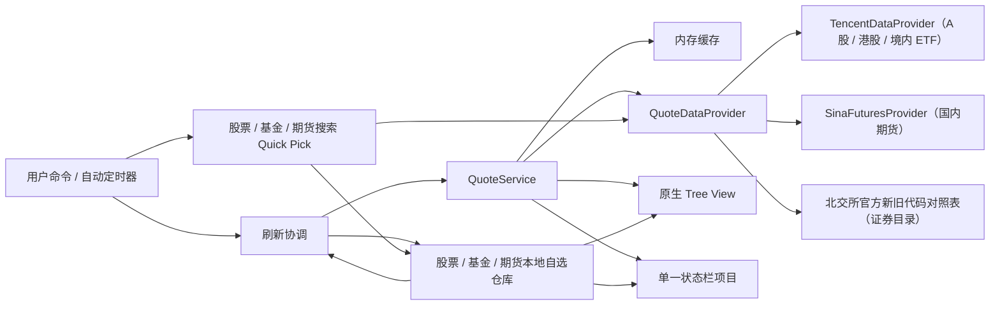

# FishStock 架构

## 设计目标

架构只保留当前阶段需要的边界：领域模型、行情数据源、本地存储、刷新调度、原生 Tree View 和单状态栏。模块通过小接口协作，避免为了未来功能引入框架或过度抽象。

## 视图层级与功能边界

```text
FishStock（Activity Bar 容器）
├─ Stock（fishStock.stock）
│  └─ 分组 → 个股或指数
├─ Fund（fishStock.fund）
│  └─ 分组 → 境内交易所 ETF
└─ Futures（fishStock.futures）
│  └─ 分组 → 主连或月份合约
```

`Stock`、`Fund` 和 `Futures` 是 FishStock 容器中的三个同级 View，不是自选树的根节点。股票和市场指数共享 Stock 分组；沪深交易所 ETF 使用 Fund；期货因交易时段、代码和行情字段不同使用 Futures。三个品类各自拥有命令、存储、视图状态和刷新状态，只在单一状态栏轮播、通用价格模型和参数化原生树处汇合。

## 模块

| 模块 | 目录 | 责任 |
| --- | --- | --- |
| 领域模型 | `src/domain` | 股票、分组、行情结构；代码规范化；顺序调整；交易日历与休市判断；视图展示方式；行情页 URL 模板；脱敏诊断汇总与格式化 |
| 行情数据 | `src/data` | 提供器接口、腾讯股票/ETF 行情、新浪期货行情、北交所证券目录、节假日休市数据、缓存及请求合并 |
| 本地存储 | `src/storage` | 股票、基金与期货的独立版本化自选结构、视图展示方式与状态栏轮播分组选择、校验和读写 |
| 刷新调度 | `src/services` | 自动刷新间隔、同一任务合并与交易时段边界监控 |
| 行情展示 | `src/ui/quoteTooltip.ts` | Tree View 与状态栏共享的价格格式和原生行情浮窗 |
| Tree View | `src/ui/watchlistTreeProvider.ts` | 两层原生树、状态文案、主题颜色、排序与筛选 |
| 状态栏 | `src/ui/statusBarController.ts` | 按用户选择的分组轮播“股票名称 + 现价 + 涨跌幅”，悬停复用完整行情浮窗 |
| 命令 | `src/commands` | 参数化命令集 `registerWatchlistCommands`，按股票/基金/期货的命令 ID 与文案装配添加、删除、分组、排序、清空、恢复默认、视图方式与行情页跳转 |
| 装配入口 | `src/extension.ts` | 激活、配置响应、模块生命周期 |

## 数据流



刷新读取本机自选列表，将规范化代码交给 `QuoteService`。服务按代码排序生成批次键，同批次在途请求复用同一个 Promise；非强制刷新按最近一次成功请求的完成时间复用 10 秒内缓存，即使休市行情本身的更新时间较早也不会绕过短缓存。行情是否过期仍使用供应商给出的行情时间判断。提供器返回的原始字段必须经过解析和数值校验，UI 不直接理解第三方响应格式。

行情模型除现价和昨收/昨结外，还可携带今开、最高、最低、成交量、成交额、换手率、PE(TTM)、总市值、持仓量和交易所。股票浮窗根据规范化代码补充上交所、深交所、创业板、科创板、北交所或港交所；期货浮窗展示昨结、成交量、持仓量和交易所，不套用股票估值字段。Tree View 和状态栏调用同一个原生 `MarkdownString` 构建器，不引入 Webview。

添加条目使用原生 Quick Pick。用户输入中文名称、拼音简称或代码后，命令层以 250 毫秒防抖调用提供器搜索；新输入会取消上一请求。Stock 接受腾讯的 A 股、港股和市场指数类型；Fund 只接受沪深交易所 `ETF` 类型并过滤 `KJ` 等场外基金；北交所存量证券名称及新旧代码来自官方公开对照表。扩展内置一份发布时快照，并在 `globalState` 缓存成功更新结果：只有用户主动搜索且缓存超过 7 天时才尝试更新，失败后 24 小时内不重试。Stock 搜索端点没有代码结果时，提供器会对可规范化代码直接查询一次行情并生成预览，因此新上市 `920` 股票仍可按代码添加。只有用户选中预览结果后才写入目标分组，无结果和请求失败都在 Quick Pick 内克制提示。

指数使用独立规范化后缀：上海指数为 `.SHI`、深圳指数为 `.SZI`、港股指数为 `.HKI`。例如上证指数是 `000001.SHI`，平安银行是 `000001.SZ`，二者不会因数字代码相同而冲突。数据源适配器在请求腾讯时再分别转换为 `sh000001` 和 `sz000001`；存储、缓存和 UI 只使用规范化代码。

国内期货使用 `.CNF` 后缀，例如沪铝主连是 `AL0.CNF`，月份合约是 `AL2608.CNF`。期货搜索先识别新浪品种搜索结果，再按未来 24 个月生成四位年份及郑商所三位年份候选代码；只保留行情日期与该品种主连一致的合约，避免把接口仍能返回历史报价的到期合约当成有效合约。

## 本地数据结构

```json
{
  "version": 1,
  "groups": [
    {
      "id": "stable-id",
      "name": "默认",
      "collapsed": false,
      "stocks": [
        {
          "id": "stable-id",
          "symbol": "600519.SH",
          "market": "CN",
          "name": "贵州茅台"
        }
      ]
    }
  ]
}
```

存储位置是扩展的 `globalState`，股票使用 `fishStock.watchlist.v1`，基金使用 `fishStock.funds.v1`，期货使用 `fishStock.futures.v1`，状态栏轮播排除项使用 `fishStock.statusBarRotation.v1`；没有调用 `setKeysForSync`。卸载或升级扩展通常保留数据。载入时会校验版本、分组、ID、代码格式和全局重复代码；有效状态只读取到内存，不在每次激活时重复写回。无效数据回退并持久化为该品类的默认状态。股票可恢复三组共 11 个默认条目；基金默认包含沪深300ETF示例；期货默认包含五个主连合约。三个仓库均可独立清空或恢复默认。

期货仓库为了复用版本 1 的最小结构，内部字段仍名为 `stocks`，但它只存放 `.CNF` 条目且位于独立命名空间。这是内部持久化兼容细节，不代表期货被放入 Stock View，也不是公开 JSON 导入导出格式。

`Stock`、`Fund` 与 `Futures` 保持为三个可在 VS Code Views 菜单中独立显示或隐藏的原生 View。扩展清单以 `visibility: visible` 和 `initialSize` 权重 `2:1:1` 提供全新工作区的默认展开布局。View 隐藏期间的行情树更新会被合并，首次显示直接读取当前内存缓存。扩展不在启动阶段调用 `TreeView.reveal`，因此不会改变活动侧边栏，也不会在一个 View 展开时联动其他 View。VS Code 只在工作区首次见到 View 时采用清单默认值，之后的折叠状态和高度由原生布局保存，用户可拖动或双击分隔线重新分配。

## 行情状态

- `live`：当前处于交易时段，已有当前交易日行情，且最近一次成功获取在过期阈值内；阈值内的刷新失败作为警告附加，不立即降级。
- `closed`：午休、盘间休息、收盘、周末或节假日，最近有效行情仍可展示。
- `stale`：持续没有成功获取超过阈值、行情早于当前或最近交易日、行情时间晚于本机容差，或期货夜盘规则尚未收录；分别记录 `refresh-overdue`、`quote-not-current`、`future-timestamp`、`session-uncovered` 原因。
- `error`：没有有效行情可展示，标记“暂不可用”。

`marketSessions` 领域模块根据规范化市场、期货品种和上海时区时间生成阶段、所属交易日、该交易日可接受行情的最早时间、下次开盘与下次边界。A 股、港股和国内商品期货共用这一最终状态判断，数据提供器只解析供应商字段，不再推断开休市。股票的各日内小节共享当日边界；期货夜盘和次日日盘共享所属交易日边界。节假日数据显式声明覆盖区间；未覆盖年份继续按工作日回退，并在脱敏诊断中暴露日历覆盖终点。

国内商品期货规则由 `futuresSessions` 按品种登记交易所与夜盘终点。日盘采用国内商品期货通用三节；夜盘只有规则已收录时才精确启用。搜索层拒绝新增未知规则品种，但存储层继续接受升级前已有数据，避免破坏用户自选。

后台失败只更新状态和 FishStock 输出通道，不连续弹通知。手动刷新使用短暂状态栏消息反馈结果。

腾讯股票、腾讯 ETF 或新浪期货行情若返回 HTTP 403，各自的提供器记录连续拒绝次数和下次自动探测时间；调度器在退避窗口内只跳过对应模块。退避从 15 分钟递增到最长 6 小时，手动刷新可以随时绕过等待；对应行情请求成功后立即清零。该状态只保存在当前扩展进程，不写入用户自选数据。

用户可主动执行“复制运行诊断信息”。装配层只把版本、配置、交易日与时段计数、日历覆盖终点、期货规则覆盖计数、分组/条目数量、行情状态与过期原因计数和最近刷新结果交给领域格式化函数；报告不读取自选名称、证券代码、文件路径或工作区信息，也不会自动上传。原始错误详情继续保留在 FishStock 输出日志中，由用户自行决定是否查看或分享。

## 刷新策略

后台调度按每个规范化条目计算当前时段，只把 `trading` 条目发送给对应提供器；同一 View 中的 A 股、港股和不同夜盘组可以独立启停。`MarketSessionMonitor` 调度最近的开盘、休息、收盘或行情过期边界，立即刷新 Tree View 与状态栏，并为发生开闭切换的条目补一次强制行情请求。扩展激活时先完成本地数据和 Tree View 装配，再异步启动一次不受时段限制的初始化刷新；行情源响应速度不阻塞本地分组展示。

- 自动刷新默认 60 秒，配置下限 15 秒；非当前交易时段的条目不参与常规请求，访问拒绝退避仍按提供器独立生效。
- 手动刷新强制请求当前 View 的全部条目，不受休市、节假日、10 秒短缓存或自动退避限制；结果文案区分正常刷新、当前休市、规则未收录和刷新失败。
- 内置 A 股 2024–2026 年与港股 2025–2026 年节假日日历，2027 年起回退为工作日判断；港股半日市单独登记。
- 状态栏默认每 5 秒在用户选中的分组内轮播，默认选择全部分组；轮播不触发网络请求。
- 同一品类、同一代码集合的并发刷新请求会合并，调度器运行中的重复触发也会合并。
- 非强制调用按成功请求完成时间复用 10 秒内缓存。
- 交易中距最近一次成功获取默认超过 120 秒标记为刷新超时；成功取得有效条目即更新时间，不要求价格或行情时间发生变化。
- 行情源时间用于验证行情是否属于当前或最近交易日以及是否异常超前，不再承担请求健康度判断，也不决定开休市。

## 数据源扩展点

新增真实行情源时实现 `QuoteDataProvider`，需要搜索能力的品类再实现对应搜索接口：

1. 声明提供器 ID、显示名称与市场覆盖。
2. 实现该品类的名称及代码搜索，返回标准化搜索结果。
3. 把标准化代码转换为供应商代码。
4. 只负责请求、供应商编码转换和返回 `RawMarketQuote`。
5. 让公共解析器计算涨跌并校验关键字段。
6. 在装配层替换提供器，不让 Tree View、状态栏或存储引用供应商字段。

涉及密钥的未来提供器应使用 VS Code `SecretStorage`，不能写入设置、日志或本地自选数据。是否引入需要用户另行作产品决策。

## 测试边界

当前单元测试覆盖：

- A 股、港股、指数和国内期货的代码规范化，包括北交所 `920` 代码；美股仅保留规范化格式测试，没有提供器、搜索或 UI 覆盖
- 行情字段解析、涨跌计算与错误输入
- 日内行情、成交和估值扩展字段的单位归一化
- 搜索响应解析、科创板与指数类型识别、沪深 ETF 类型识别及场外基金过滤
- 同数字代码的指数/个股区分和同名指数别名去重
- 北交所官方代码对照表解析、名称/新旧代码匹配和持久缓存
- 搜索无结果时按规范化代码直接查询行情
- 顺序调整及边界
- 股票、基金与期货独立本地存储、跨组移动、去重和载入校验
- 股票上市板块识别，以及期货搜索、有效合约筛选和行情字段解析
- 清空、恢复默认以及重新加载后的持久化结果
- 行情短缓存、成功获取时间与行情源时间分离、失败宽限期、细分过期原因、同批次在途请求和调度任务合并
- A 股、港股与分品种期货时段、午休、夜盘跨日、节假日前夜盘关闭、跨年回退与自动刷新守卫
- 行情在 `live`、`closed`、`stale`、`error` 之间的动态流转，以及刷新失败后的缓存保留
- 行情页跳转的六类市场 URL 模板
- 视图排序与筛选的纯函数行为，以及视图选项存储的读写与非法值回退
- 股票、基金与期货命令 ID 与扩展清单声明的一致性
- 脱敏诊断的计数、格式与隐私边界

独立 VS Code Extension Host 冒烟测试覆盖扩展激活、Stock/Fund/Futures 打开、关键命令注册和全部展开命令执行。`pnpm run release:check` 把单元测试、Extension Host 冒烟、版本一致性、VSIX 文件清单与打包结果组合成统一发布门槛。
