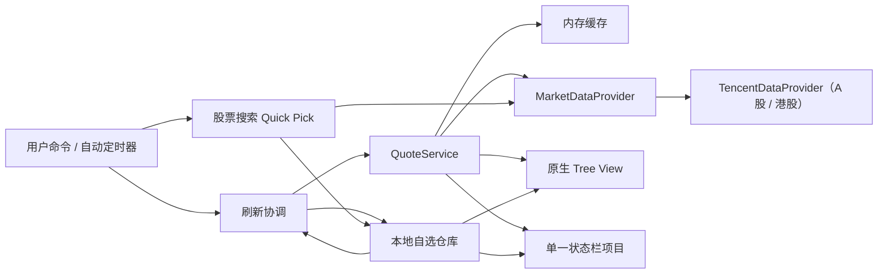

# FishStock 架构

## 设计目标

架构只保留当前阶段需要的边界：领域模型、行情数据源、本地存储、刷新调度、原生 Tree View 和单状态栏。模块通过小接口协作，避免为了未来功能引入框架或过度抽象。

## 视图层级与功能边界

```text
FishStock（Activity Bar 容器）
├─ Stock（fishStock.stock，当前实现）
│  └─ 分组 → 个股
└─ Fund（未来可选，当前不实现）
```

`Stock` 是 FishStock 容器中的独立 View，不是股票树的根节点。未来若增加基金，应在同一容器下贡献新的同级 View，并使用独立的命令、存储和数据提供器；不把基金节点混入 `Stock` 的两层树，也不为了尚未实现的功能提前建立通用资产模型。

## 模块

| 模块 | 目录 | 责任 |
| --- | --- | --- |
| 领域模型 | `src/domain` | 股票、分组、行情结构；代码规范化；顺序调整 |
| 行情数据 | `src/data` | 提供器接口、腾讯搜索与行情解析、缓存及请求合并 |
| 本地存储 | `src/storage` | 版本化自选结构、校验、读写与导入替换 |
| 刷新调度 | `src/services` | 自动刷新间隔与同一任务合并 |
| Tree View | `src/ui/watchlistTreeProvider.ts` | 两层原生树、状态文案、主题颜色 |
| 状态栏 | `src/ui/statusBarController.ts` | 唯一状态栏项目与轮播 |
| 命令 | `src/commands` | 添加、删除、分组、排序、导入、导出 |
| 装配入口 | `src/extension.ts` | 激活、配置响应、模块生命周期 |

## 数据流



刷新读取本机自选列表，将股票代码交给 `QuoteService`。服务按标准化代码排序生成批次键，同批次在途请求复用同一个 Promise；非强制刷新可复用 10 秒内缓存。提供器返回的原始字段必须经过解析和数值校验，UI 不直接理解第三方响应格式。

添加股票使用原生 Quick Pick。用户输入中文名称、拼音简称或代码后，命令层以 250 毫秒防抖调用提供器搜索；新输入会取消上一请求。只有用户选中预览结果后才写入目标分组，无结果和请求失败都在 Quick Pick 内克制提示。

## 本地数据结构

```json
{
  "version": 1,
  "groups": [
    {
      "id": "stable-id",
      "name": "默认",
      "collapsed": false,
      "stocks": [
        {
          "id": "stable-id",
          "symbol": "600519.SH",
          "market": "CN",
          "name": "贵州茅台"
        }
      ]
    }
  ]
}
```

存储位置是扩展的 `globalState`，没有调用 `setKeysForSync`，因此 FishStock 不主动把自选列表加入 Settings Sync。导入时会校验版本、分组、ID、代码格式和全局重复股票；确认后才整体替换。

## 行情状态

- `live`：开市且数据未过期。
- `closed`：数据源明确说明当前休市；展示最后价并标记“休市”。
- `stale`：开市数据超过阈值，或刷新失败但仍有可用缓存。
- `error`：没有可展示缓存，标记“暂不可用”。

后台失败只更新状态和 FishStock 输出通道，不连续弹通知。手动刷新使用短暂状态栏消息反馈结果。

## 刷新策略

- 自动刷新默认 60 秒，配置下限 15 秒。
- 状态栏默认每 5 秒轮播，轮播不触发网络请求。
- 同一股票集合的并发刷新请求会合并。
- 非强制调用可复用 10 秒内缓存。
- 开市行情默认超过 120 秒标记过期。
- 休市由提供器显式返回，不按更新时间误判为过期。

## 数据源扩展点

新增真实行情源时实现 `MarketDataProvider`：

1. 声明提供器 ID、显示名称与市场覆盖。
2. 实现名称、简称及代码搜索，返回标准化的 `StockSearchResult`。
3. 把标准化代码转换为供应商代码。
4. 只负责请求、供应商编码转换和返回 `RawMarketQuote`。
5. 让公共解析器计算涨跌并校验关键字段。
6. 在装配层替换提供器，不让 Tree View、状态栏或存储引用供应商字段。

涉及密钥的未来提供器应使用 VS Code `SecretStorage`，不能写入设置、日志或自选 JSON。是否引入需要用户另行作产品决策。

## 测试边界

当前单元测试覆盖：

- A 股、港股和未来美股格式的代码规范化
- 行情字段解析、涨跌计算与错误输入
- 股票搜索响应解析及非股票结果过滤
- 顺序调整及边界
- 本地存储持久化、跨组移动、去重和导入校验

Tree View 和 Extension Host 的端到端交互留到后续增加自动化测试；当前通过本地 Extension Development Host 手工冒烟。
